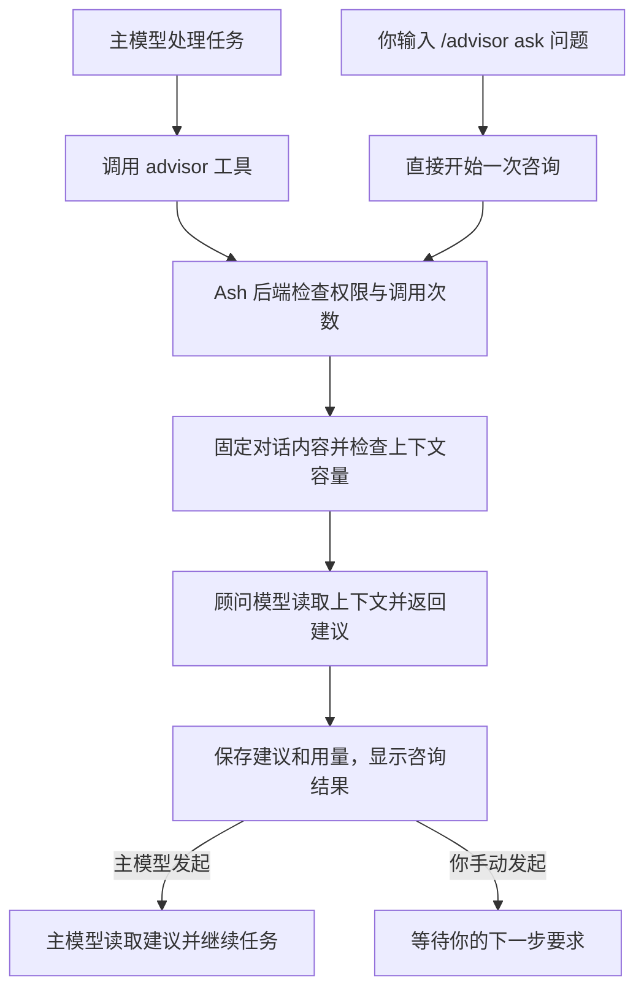

# 使用 Advisor 获取第二意见

Advisor 让 Ash 在开发任务中向另一个模型咨询。主模型负责推进任务，顾问根据已有对话指出问题、比较方案并提出建议。你可以选择顾问模型，让主模型决定何时咨询，也可以用 `/advisor ask` 立即提问。

## 什么时候使用顾问

顾问适合需要重新检查判断的时刻：

* 确定重构方案前，检查是否遗漏了依赖或约束。
* 同一个错误反复出现时，检查当前假设是否成立。
* 准备结束任务时，检查证据是否足以支持完成结论。

把问题写具体。例如，询问取消请求是否会留下未完成写入，比要求顾问重新检查整个项目更容易得到可验证的建议。顾问没有工具，不能自行搜索文件、修改代码或运行测试。

## 选择顾问模型

在 Ash 桌面工作台的聊天输入框或终端界面中操作。先连接后端，并配置需要使用的模型供应商。

1. 输入 `/advisor`，打开顾问选择器。
2. 从列表中选择模型。该选择保存到当前对话，不更换主模型。
3. 发送下一条任务消息。主模型在这一轮中可以调用顾问。

如果知道模型标识，也可以直接输入：

```text
/advisor <provider>/<model>
```

将 `<provider>` 和 `<model>` 替换为模型列表中的供应商标识和模型标识。模型必须存在于可用列表中，实际调用还需要有效的供应商配置和访问凭据。

## 发起咨询

自动咨询和手动咨询使用同一个顾问配置，但后续行为不同。

| 方式 | 如何开始 | 收到建议后 |
| --- | --- | --- |
| 主模型咨询 | 启用顾问后，主模型根据任务决定是否调用 `advisor` 工具 | 主模型读取建议，结合已有证据继续任务 |
| 手动咨询 | 输入 `/advisor ask <问题>` | 显示建议，等待你的下一步要求 |

### 让主模型在任务中咨询

启用顾问并不保证每轮都会咨询。你可以在任务要求中说明希望检查的决策：

```prompt
修复保存操作被取消后仍写入文件的问题。确定方案前请咨询顾问，重点检查取消信号是否覆盖整个写入过程，再实现并运行相关测试。
```

顾问返回的是建议。主模型仍需要读取相关代码、验证判断并完成任务。

### 立即获取第二意见

等待当前轮结束，然后输入：

```text
/advisor ask 根据刚才的代码和测试结果，取消保存后是否还可能写入文件？指出缺少的验证。
```

这会直接开始一次顾问咨询，不需要主模型先决定是否调用工具。咨询结束后不会自动修改代码，也不会触发目标自动续跑。要继续执行，可以再发送一条消息，例如要求主模型验证建议中的问题。

## 一次咨询如何完成

两种入口都由 Ash 后端检查权限、准备上下文、调用顾问并保存结果。



选择模型或关闭顾问只改变配置，不会发起咨询。只有主模型实际调用工具，或你提交 `/advisor ask` 时，才进入上面的调用流程。

## 顾问能看到什么

每次咨询使用发起时固定的对话内容，包括问题、任务指令、消息，以及已完成的工具调用和结果。对话中的代码、测试输出和附件因此也可能发送给你选择的顾问供应商。

顾问不会自动扫描整个工作区。它只能判断这次输入中提供的证据。需要检查尚未读取的文件时，先让主模型读取文件并把结果加入对话，再咨询顾问。

* 尚未完成的工具调用不会作为完整证据发送。
* 对话已经压缩时，顾问沿用已有摘要和保留的记录，不保证看到压缩前的全部原文。
* 咨询开始后的新消息、工具结果和文件变化不会补入这次请求。
* 已知的上下文窗口不足时，Ash 返回错误，不会为了这次咨询自动再次压缩对话。

顾问没有可用工具，也不能再次调用顾问。建议本身不授予执行权限，后续操作仍遵循当前的[权限与批准](/docs/configure/permissions.md)。

## 查看建议与用量

桌面工作台把顾问调用和结果合并为一张 **Advisor** 卡片。展开卡片可阅读建议，以及结果中提供的模型、问题、对话序列和 token 用量。聚焦卡片标题后，按 `Enter` 展开或收起。终端界面在工具结果中展示顾问建议与用量。

顾问每次都需要处理输入，因此会增加所选模型的用量。长对话的咨询成本也会更高。顾问用量与参考费用计入任务总计，存在目标预算时也计入该预算，但不会改变主模型的上下文占用显示。供应商没有返回用量时，记录保留未知状态。

默认限制如下：

| 项目 | 默认限制 |
| --- | --- |
| 每轮顾问调用次数 | 最多三次 |
| 每次咨询的输出 | 最多 2048 token |
| 咨询问题 | 非空，最多 8000 字节，中文字符会占多个字节 |

一轮指一次已经开始的任务执行，可以包含多次模型请求和工具调用。`/advisor ask` 单独开始一轮，只咨询一次。

## 保存默认配置或关闭顾问

| 命令 | 作用 |
| --- | --- |
| `/advisor` | 打开选择器，查看或更改当前选择 |
| `/advisor <provider>/<model>` | 为当前对话指定顾问模型 |
| `/advisor ask <问题>` | 使用当前顾问配置立即咨询 |
| `/advisor off` | 关闭当前对话后续轮次的顾问 |
| `/advisor save` | 把当前有效选择保存为全局默认 |
| `/advisor default` | 让当前对话使用全局默认 |

新对话默认跟随全局配置。没有保存默认模型时，顾问处于关闭状态。为某个对话指定模型或执行 `/advisor off` 后，该对话使用自己的选择，不跟随全局默认变化。

要把所选模型用于其他跟随默认的对话，先选择模型，再执行 `/advisor save`。要关闭全局默认，依次执行 `/advisor off` 和 `/advisor save`。其他已经单独指定模型的对话保留各自的选择。

每轮开始时会固定顾问配置。中途更换模型、保存默认或关闭顾问，都不改变正在运行的一轮。要中止正在运行的咨询，使用当前任务的停止操作。

从对话创建分支时，分支继承分支点的顾问选择。子 Agent 不自动启用顾问。目标自动续跑使用当前对话的显式选择；跟随默认时，沿用目标上一轮已固定的配置。

## 排查咨询问题

| 现象 | 处理方式 |
| --- | --- |
| 提示未选择顾问 | 用 `/advisor` 选择模型。跟随默认时，也要确认已经保存默认模型 |
| 找不到指定模型 | 从选择器中选择，并核对供应商和模型标识 |
| 当前轮仍在运行 | 等待完成或停止当前轮，再执行 `/advisor ask` |
| 达到调用次数上限 | 使用已有建议继续任务，或在下一轮重新咨询 |
| 上下文超过顾问容量 | 在当前轮结束后使用 `/compact`，或选择上下文容量更大的模型 |
| 顾问拒绝回答或缺少证据 | 阅读原因，补充相关代码或测试结果，再提出具体问题 |
| 身份验证或供应商请求失败 | 检查所选供应商的凭据和连接。Ash 不会在失败后自动换模型 |
| 恢复后显示执行结果未知 | 检查已有记录，再决定是否重新咨询。已开始但结果未知的请求不会自动重发 |

## 下一步

* [了解 Agent 如何完成任务](/docs/agents/overview.md)
* [管理会话与任务](/docs/agents/sessions.md)
* [检查工具活动](/docs/reference/tools.md)
