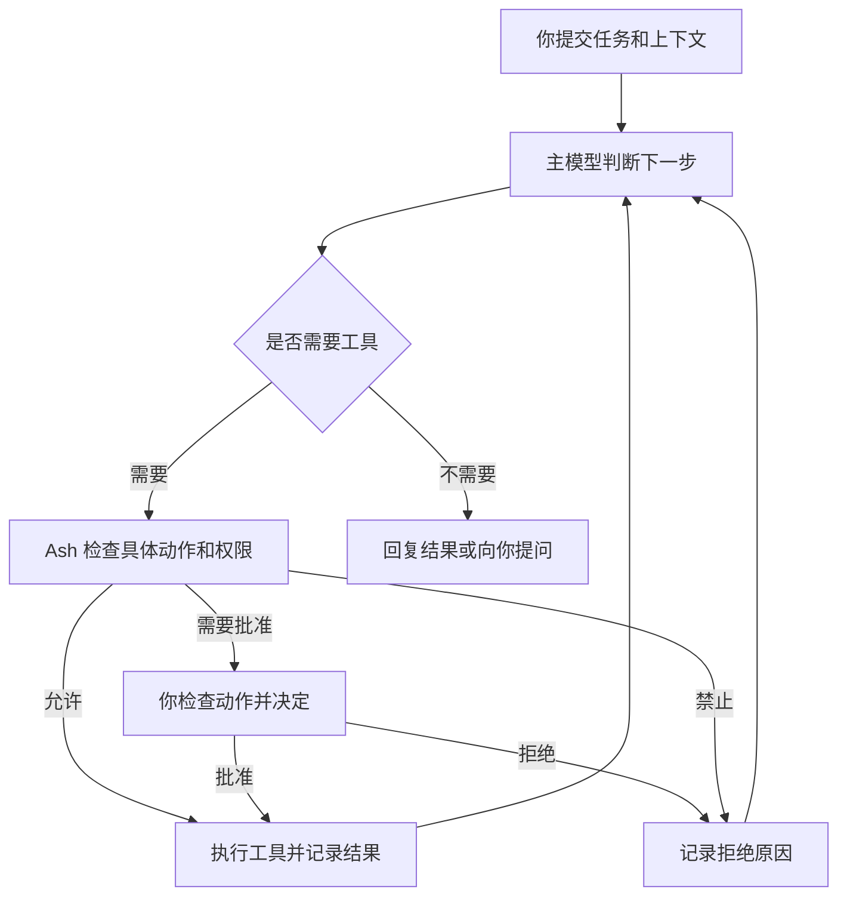

# Agent 概览

Ash Agent 根据你的要求读取代码、调用工具、修改文件并验证结果。你可以查看工具活动、补充要求，并在需要批准时决定是否执行。本页帮助你提交清楚的任务，并判断结果是否满足要求。

## 写清楚任务

任务说明包含三部分：

* **结果**：最终需要得到什么。
* **范围**：处理哪些文件、功能或产品。
* **验收**：运行哪些测试，或满足什么可观察行为。

```prompt
修复设置页保存后状态不刷新的问题，只改设置模块。复现问题后再修改，运行相关的浏览器测试，并说明验证结果。
```

如果暂时只想讨论方案，也要直接说明：

```prompt
先分析保存流程中状态不同步的原因，比较两个修复方案和各自风险。等我选定方案后再修改代码。
```

## Agent 如何完成任务

主模型决定下一步需要什么信息或操作；Ash 根据具体动作检查权限，执行工具并把结果交回模型。



读取文件、运行测试和修改外部系统都可以出现在这个过程中，但适用的权限不同。具体规则见[权限与批准](/docs/configure/permissions.md)。

## 提供有效上下文

你可以提供问题描述、文件、附件和已知的复现步骤。Agent 还可以通过工具读取工作区，并按需加载适用的指令与 Skills。

文件存在于工作区，不代表全文已经进入模型上下文。提问时指出关键路径、错误输出和预期行为，可以帮助 Agent 找到证据。已连接的 MCP 服务器提供工具，其全部数据也不会自动加入每条消息。

长对话可能使用压缩摘要。需要精确核对代码或日志时，要求 Agent 重新读取相关内容。

## 选择主模型和顾问

主模型负责推进任务。桌面工作台在聊天输入区选择主模型，Ash Code 使用 `/model`；实际可用模型取决于已配置的供应商和账号。

需要第二意见时，使用 `/advisor` 选择顾问。主模型可以在任务中咨询它，也可以在当前轮结束后输入 `/advisor ask <问题>` 直接咨询。顾问只阅读提供的上下文并给出建议，没有自己的工具。完整用法见 [Advisor 顾问](/docs/agents/advisor.md)。

## 调整方向和检查结果

任务进行中可以补充要求。桌面工作台发送消息会补充当前可接收输入的任务；Ash Code 运行中按 `Enter` 排队，按 `Ctrl+Enter` 才补充当前任务。状态与操作说明见[会话与任务](/docs/agents/sessions.md)。

收到完成回复后，检查：

* 改动是否覆盖了原来的问题。
* 测试是否实际运行并完成。
* 报告的结果是否有工具输出支持。
* 是否还有未完成事项或需要你决定的步骤。

## 下一步

* [检查工具活动与执行结果](/docs/reference/tools.md)
* [用 Skills 复用工作方法](/docs/customize/skills.md)
* [连接 MCP 外部工具](/docs/customize/mcp-servers.md)
